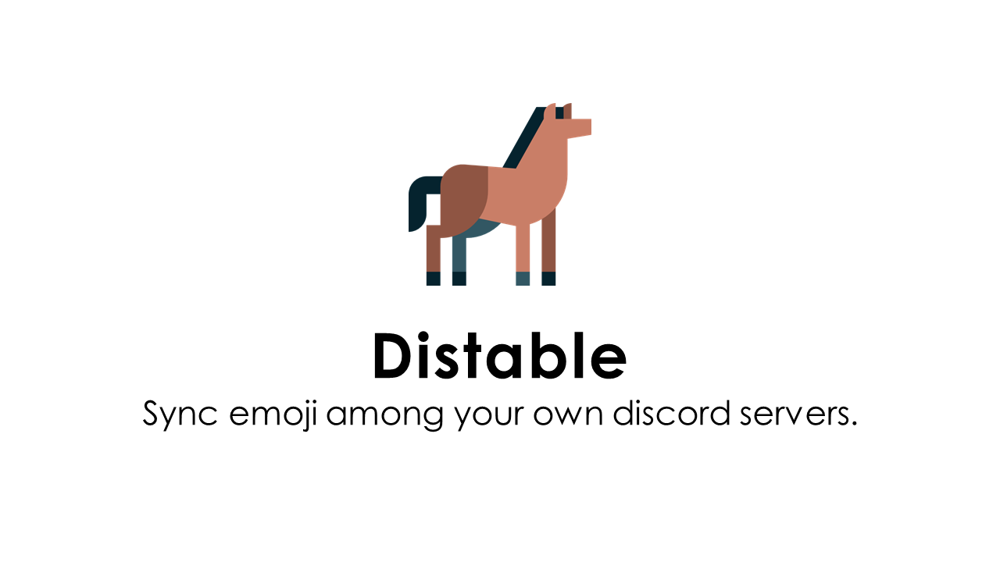

<div>Icons made by <a href="https://www.flaticon.com/authors/freepik" title="Freepik">Freepik</a> from <a href="https://www.flaticon.com/" title="Flaticon">www.flaticon.com</a></div>

# Distable
Sync emojis among your own discord servers.
Thanks to it, you / your guild's members can use same emoji on relevant communities.

Distable is inspired by [FromAtom/Utsushie](https://github.com/FromAtom/Utsushie).

## Installation

```shell script
$ go get github.com/usagiga/Distable
```

## Usage

### 1. Setup Discord App & Bot

Make new app [here](https://discordapp.com/developers/applications).
Then make new bot on the app.

Open it on your browser, then authorize the app in all servers which you wanted to sync emojis.

```
https://discordapp.com/oauth2/authorize?&client_id=APP_CLIENT_ID_HERE&scope=bot&permissions=1073741824
```

NOTICE : You shouldn't use PUBLIC BOT mode.


### 2. Configure

Write bot token and guild(a.k.a server)'s ID into `config.json`.
Put it on a directory as you like.

NOTICE : You can put 3 or more servers into it.

#### Example

```json:example
{
  "servers": [
    {"auth_token": "YOUR_APP'S_BOT_TOKEN_HERE", "guild_id": "A_SERVER_ID"},
    {"auth_token": "YOUR_APP'S_BOT_TOKEN_HERE", "guild_id": "B_SERVER_ID"}
  ]
}
```

### 3. Launch

Just run it on directory put `config.json` .
Sync all server's emojis automatically :tada:

## Dependencies

- Go (1.14 or higher)
- [github.com/bwmarrin/discordgo](https://github.com/bwmarrin/discordgo)
- [github.com/vincent-petithory/dataurl](https://github.com/vincent-petithory/dataurl)

## License

MIT
